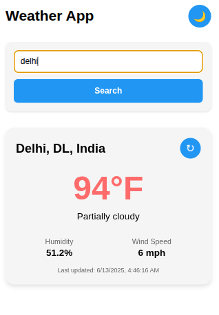
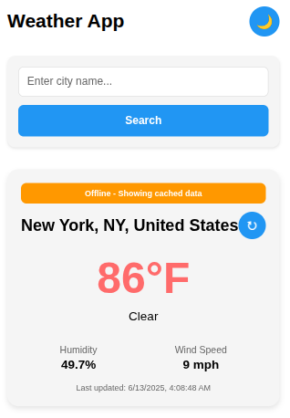
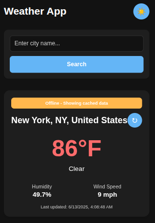

# 🌤️ WeatherApp

A simple and performant React Native application built with Expo that allows users to search for weather data by city name. The app displays key weather metrics and caches the last searched data for offline access.

---

## 🌐 Expo Demo

**Live Demo:** exp://qzwo6c4-anonymous-8084.exp.direct

**👉 Try it on Expo Go:**
1. Install [Expo Go](https://expo.dev/client) on your mobile device
2. Open the camera app and scan the QR code below
   
3. Or manually enter the link: `exp://qzwo6c4-anonymous-8084.exp.direct`
---

## 📸 Screenshots

| Home Screen | Search Results | Dark Mode |
|-------------|----------------|-----------|
|  |  |  |

---
## 🎥 Demo Video

https://github.com/user-attachments/assets/your-video-file.mp4

---


## 📱 Features

- 🔍 Search weather by city name
- 🌡️ Display temperature, humidity, wind speed, and condition
- 💾 Offline caching of last searched data using AsyncStorage
- ⚙️ MVVM architecture for clean separation of concerns
- 🚫 Graceful error handling for invalid cities and network issues

### 🚀 Bonus Features

- 🔄 Pull-to-refresh to manually reload weather
- 🌙 Dark mode support (based on system setting)
- ⏳ Debounced search input (optional)
- 📲 Expo deployment for easy testing

---

## 📂 Project Structure

```
WeatherApp/
├── app/                          # Expo Router pages
│   ├── _layout.tsx
│   └── index.tsx
├── src/
│   ├── models/                   # Weather data interfaces
│   ├── viewmodels/              # ViewModel logic (state + actions)
│   ├── views/components/        # Reusable UI components
│   ├── services/                # API logic (VisualCrossing)
│   └── context/                 # (optional) Theme or global context
├── assets/
├── README.md
└── package.json
```

---

## ⚙️ Tech Stack

- **React Native + TypeScript**
- **Expo** (with Expo Router)
- **AsyncStorage** for offline caching
- **Fetch API** for network requests
- **No external UI libraries** (only native styling)

---

## 🛠️ Setup Instructions

### 1. 📦 Install Dependencies

```bash
npm install
# or
yarn install
```

### 2. 🔑 Add API Key

Replace `YOUR_API_KEY` in `src/services/weatherService.ts` with your VisualCrossing Weather API key.

### 3. ▶️ Run the App

```bash
npx expo start
```

Then scan the QR code using **Expo Go** on your mobile device.

---

## 🧪 Testing Features

1. Search for a city (e.g., `London`)
2. Disable your internet connection and restart the app — you should still see the last searched data
3. Pull down to refresh weather (if implemented)
4. Try an invalid city name to test error handling

---

## ✅ Architecture: MVVM

- **Model**: `src/models/Weather.ts`
- **View**: `app/index.tsx`, `src/views/components/`
- **ViewModel**: `src/viewmodels/useWeatherViewModel.ts`
- **Service**: `src/services/weatherService.ts`


---

## 📄 License

MIT – Free to use and modify.

---

## 🤝 Contributing

1. Fork the project
2. Create your feature branch (`git checkout -b feature/AmazingFeature`)
3. Commit your changes (`git commit -m 'Add some AmazingFeature'`)
4. Push to the branch (`git push origin feature/AmazingFeature`)
5. Open a Pull Request

---

## 📞 Support

If you encounter any issues or have questions, please open an issue on GitHub.

**Happy coding! 🚀**
